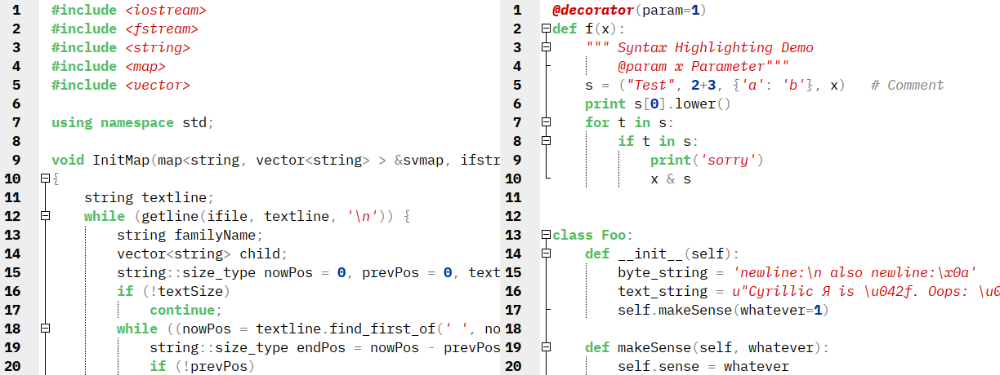
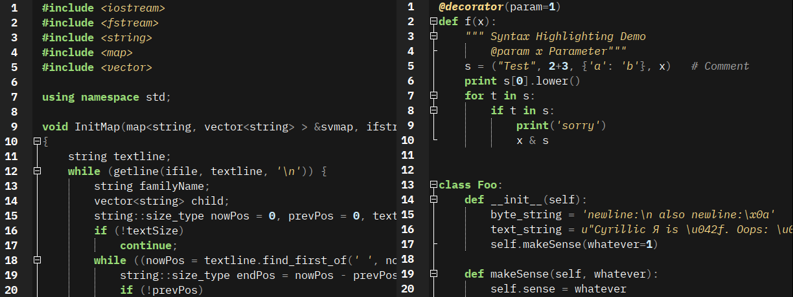

# contrarst-geany-theme
A light and a dark three colour (excluding background and foreground)
theme for geany based on percieved brightness and trial and error.
I made this theme because most that I found were either too high contrast
or too muted, too much colour or too little. I also fell in love with
de-emphasised symbols (+, ->, ==, (), etc), as it is in gruvbox.
Thus I decided to make my own.

I don't use all of the features available in geany, nor do I write
in every programming/markdown language. If something seems like a mistake
or an oversight, please tell me.

# Attributions
- Thanks to [uloco](https://github.com/uloco) for their
[syntax-highlighting-samples](https://github.com/uloco/syntax-highlighting-samples).
- Font used in screenshots is IBM Plex Mono by IBM.
- Screenshots taken using the `maim` tool and composed together using GIMP.
